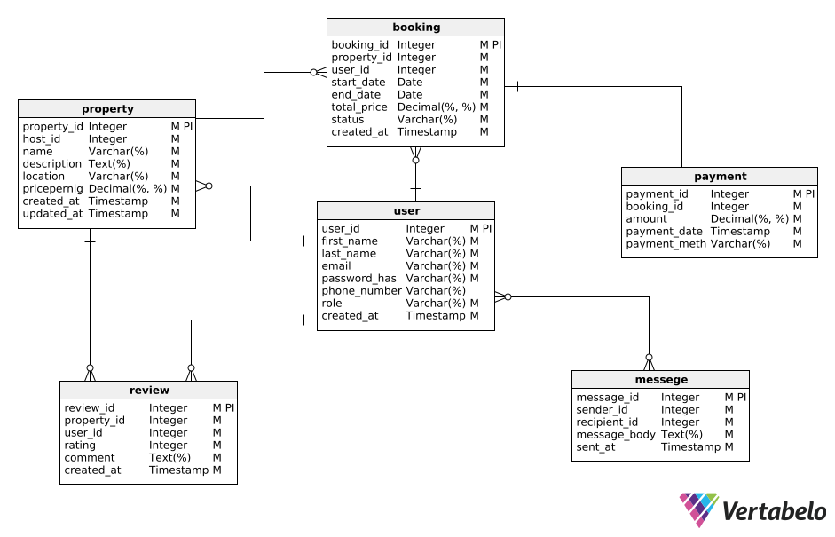

## 🗂️ Entities and Attributes

### 1. User

- `user_id` (Primary Key, UUID, Indexed)
- `first_name` (VARCHAR, NOT NULL)
- `last_name` (VARCHAR, NOT NULL)
- `email` (Unique, VARCHAR, NOT NULL)
- `password_hash` (VARCHAR, NOT NULL)
- `phone_number` (Optional, VARCHAR, NULL)
- `role` (ENUM: guest, host, admin, NOT NULL)
- `created_at` (TIMESTAMP, DEFAULT CURRENT_TIMESTAMP)

---

### 2. Property

- `property_id` (Primary Key, UUID, Indexed)
- `host_id` (Foreign Key → User, references User(user_id))
- `name` (VARCHAR, NOT NULL)
- `description` (TEXT, NOT NULL)
- `location` (VARCHAR, NOT NULL)
- `pricepernight` (DECIMAL, NOT NULL)
- `created_at` (TIMESTAMP, DEFAULT CURRENT_TIMESTAMP)
- `updated_at` (TIMESTAMP, ON UPDATE CURRENT_TIMESTAMP)

---

### 3. Booking

- `booking_id` (Primary Key, UUID, Indexed)
- `property_id` (Foreign Key → Property, references Property(property_id))
- `user_id` (Foreign Key → User, references User(user_id))
- `start_date` (DATE, NOT NULL)
- `end_date` (DATE, NOT NULL)
- `total_price` (DECIMAL, NOT NULL)
- `status` (ENUM: pending, confirmed, canceled)
- `created_at` (TIMESTAMP, DEFAULT CURRENT_TIMESTAMP)

---

### 4. Payment

- `payment_id` (Primary Key, UUID, Indexed)
- `booking_id` (Foreign Key → Booking, references Booking(booking_id))
- `amount` (DECIMAL, NOT NULL)
- `payment_date` (TIMESTAMP, DEFAULT CURRENT_TIMESTAMP)
- `payment_method` (ENUM: credit_card, paypal, stripe)

---

### 5. Review

- `review_id` (Primary Key, UUID, Indexed)
- `property_id` (Foreign Key → Property, references Property(property_id))
- `user_id` (Foreign Key → User, references User(user_id))
- `rating` (INTEGER: 1 to 5)
- `comment` (TEXT, NOT NULL)
- `created_at` (TIMESTAMP, DEFAULT CURRENT_TIMESTAMP)

---

### 6. Message

- `message_id` (Primary Key, UUID, Indexed)
- `sender_id` (Foreign Key → User, references User(user_id))
- `recipient_id` (Foreign Key → User, references User(user_id))
- `message_body` (TEXT, NOT NULL)
- `sent_at` (TIMESTAMP, DEFAULT CURRENT_TIMESTAMP)

---

## 🔗 Relationships Between Entities (Role-Aware)

| Entity A | Role(s)        | Relationship | Entity B       | Description                                                |
| -------- | -------------- | ------------ | -------------- | ---------------------------------------------------------- |
| User     | **host**       | 1 → ∞        | Property       | A host can list many properties                            |
| User     | **guest**      | 1 → ∞        | Booking        | A guest can make many bookings                             |
| Property |                | 1 → ∞        | Booking        | A property can have many bookings                          |
| Booking  |                | 1 → 1        | Payment        | Each booking has one payment                               |
| Property |                | 1 → ∞        | Review         | A property can have many reviews                           |
| User     | **guest**      | 1 → ∞        | Review         | A guest can write many reviews                             |
| User     | **guest/host** | ∞ → ∞        | Message        | Users can message each other                               |
| User     | **admin**      | -            | (all entities) | Admins can view/manage all records (role-based privileges) |

---

## 🖼️ Entity Relationship Diagram (ERD)

This diagram was generated using [Vertabelo](https://vertabelo.com) and exported as PNG.

